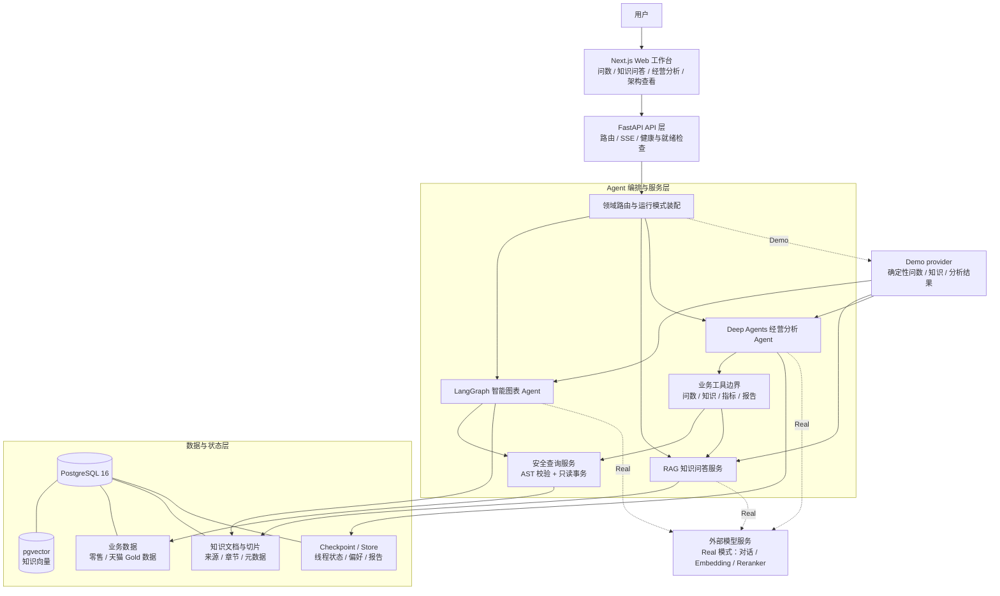
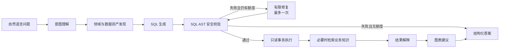
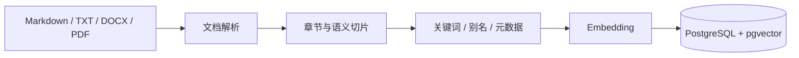
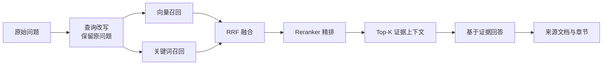
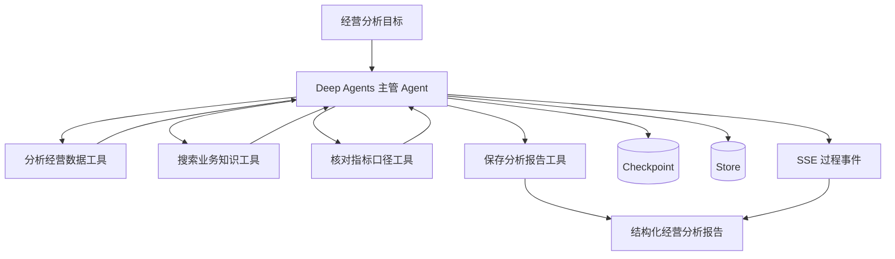
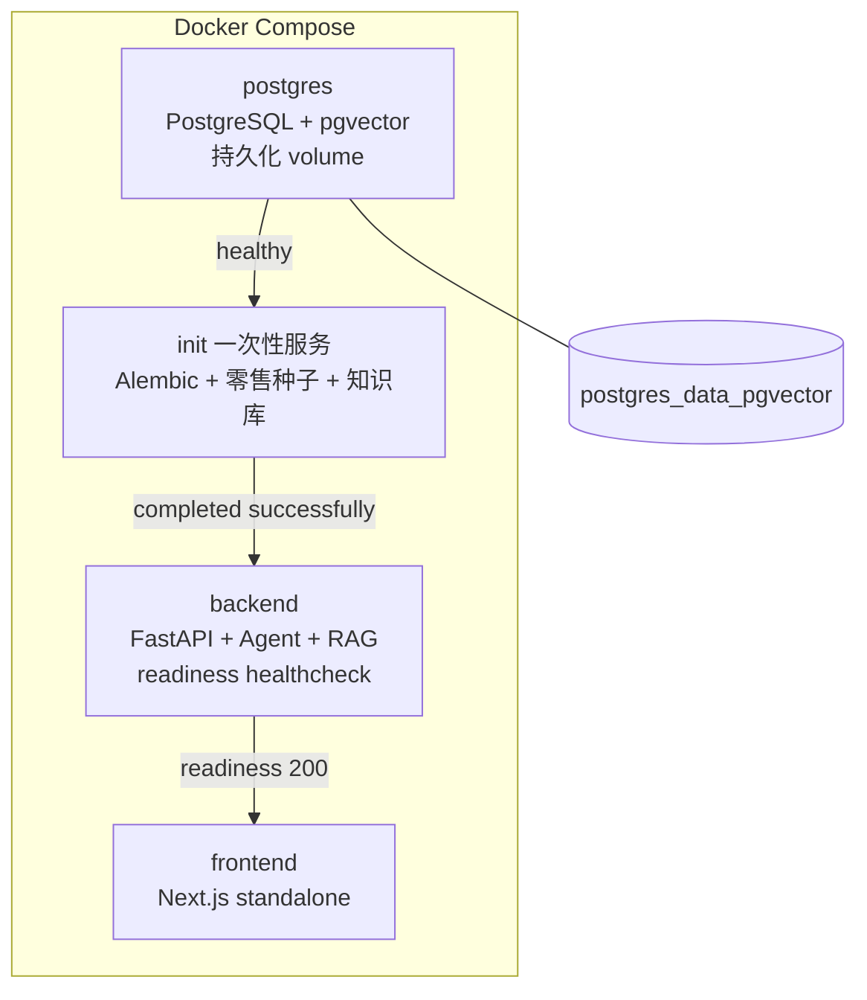

# InsightFlow 系统架构

InsightFlow 是一个面向零售与天猫数据的智能经营分析平台。它把自然语言问数、业务知识检索和多步骤经营分析组织在同一套数据与 Agent 基础设施上。

本文只描述当前仓库已经实现的能力；Kubernetes、弹性伸缩、企业身份认证、多租户和生产级监控属于后续演进方向。

## 1. 系统总架构



### 组件职责

| 层次 | 组件 | 职责 |
| --- | --- | --- |
| 交互层 | Next.js | 提供问数、知识问答、经营分析和过程展示页面。 |
| API 层 | FastAPI | 提供 HTTP/SSE 接口、请求校验、运行模式装配和服务状态检查。 |
| 编排层 | LangGraph | 编排问数流程，控制意图识别、资产发现、SQL 生成、校验、执行和解释。 |
| 编排层 | Deep Agents | 根据经营目标选择工具并完成多步骤分析。 |
| 服务层 | RAG 服务 | 负责文档处理、混合召回、RRF、精排、来源引用和降级。 |
| 安全层 | Safe Query | 执行 AST 级 SQL 检查、表字段白名单和 PostgreSQL 只读事务。 |
| 数据层 | PostgreSQL + pgvector | 同时保存业务数据、知识向量、Agent 状态、偏好和分析报告。 |
| 状态层 | Checkpoint / Store | 保存可恢复的运行状态和长期偏好。 |

## 2. 智能图表链路



安全边界是这条链路的核心：Agent 不能直接连接数据库，也不能绕过 SQL 校验。只有通过 AST 校验的单条查询，才进入只读事务；数据库层还会设置语句、锁等待和结果规模限制。

## 3. RAG 知识问答链路

### 文档入库



文档内容通过 hash 判断是否变化。未变化的文档和切片会跳过重复处理，避免重复计算向量。

### 查询与回答



外部检索服务不可用时，查询改写、向量召回和精排都有明确的降级边界；回答仍必须区分有来源证据和不可用状态，不能用无依据内容补齐结果。

## 4. 经营分析 Agent 链路



经营分析 Agent 不直接访问数据库。它通过固定的业务工具复用问数和 RAG 能力，工具结果会经过边界适配和上下文裁剪；运行过程通过 SSE 返回，状态和报告持久化到 PostgreSQL。

## 5. Docker Compose 部署结构



推荐启动路径是：

```text
复制 .env.example 为 .env
→ 设置 APP_MODE=demo 或 real
→ 运行 scripts/bootstrap.ps1
→ PostgreSQL 健康
→ init 完成迁移与初始化
→ backend readiness 通过
→ frontend healthy
```

### Health 与 Readiness

| 接口 | 含义 |
| --- | --- |
| `/api/v1/health` | 进程存活并且能够连接数据库。 |
| `/api/v1/readiness` | 已完成迁移、必要表存在、当前模式配置满足要求，可以提供业务服务。 |
| `/api/v1/runtime` | 返回当前运行模式和 Demo 支持信息，不返回敏感配置。 |

## 6. Demo 与 Real 模式

### Demo 模式

- 使用确定性 Demo provider；
- 不调用外部对话模型、Embedding 或 Reranker；
- 支持固定演示问题；
- 可以在没有外部模型凭据的环境中完成问数、知识问答和经营分析演示；
- 未收录的问题会返回明确的支持范围提示。

### Real 模式

- 默认运行模式；
- 使用真实 LangGraph 问数流程和 Deep Agents 经营分析流程；
- 使用真实模型服务、Embedding 和 Reranker；
- 继续使用安全查询、RAG 来源、Checkpoint、Store 和 SSE；
- 外部模型凭据只通过本地环境配置注入，不进入代码、镜像或文档。

## 7. 当前安全与工程边界

当前已经实现：

- Docker Compose 前后端分离和 PostgreSQL 持久化；
- init 一次性迁移与数据初始化；
- readiness 就绪检查；
- SQL AST 校验和数据库只读事务；
- Agent 工具白名单、调用上限、超时和有限修复；
- RAG 混合检索、精排、来源引用和故障降级；
- Checkpoint、Store、SSE 和报告持久化；
- Demo/Real 双运行模式。

后续演进方向：

- Kubernetes 实际部署；
- HPA 和弹性扩缩容；
- 企业统一身份认证与细粒度权限；
- 多租户隔离；
- 生产级指标、日志、链路追踪和告警；
- 高可用数据库和备份恢复体系。
