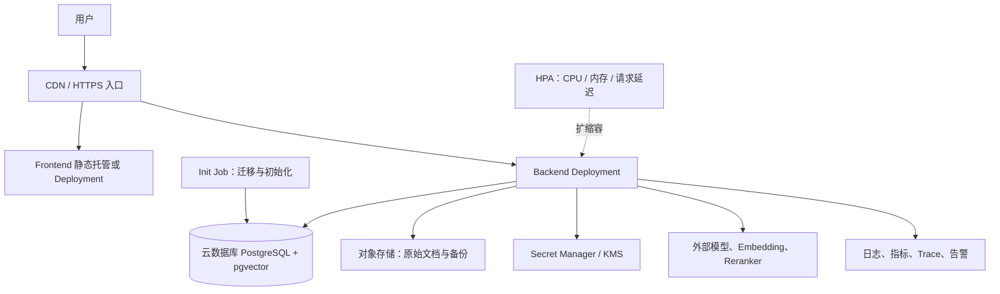

# 云原生演进设计

本文区分当前已经实现的 Docker Compose 本地部署与面向云平台的演进方案。Kubernetes、HPA、云数据库和云上 Secret 管理是目标架构设计，不应表述为当前已经部署的能力。

## 1. 当前 Compose 到云上组件映射

| 当前服务 | 当前实现 | 云上演进 | 部署建议 |
| --- | --- | --- | --- |
| `frontend` | Next.js standalone 容器 | 静态托管/CDN 或 Deployment + Service | 优先 CDN；需要同域服务端能力时使用 Deployment |
| `backend` | FastAPI + Agent + RAG | Deployment + ClusterIP Service | 无状态副本，外部状态放数据库和状态存储 |
| `init` | 一次性迁移、种子和知识库初始化 | Kubernetes Job / 发布前 Job | 只在发布或数据初始化时运行，不作为常驻服务 |
| `postgres` | PostgreSQL + pgvector 容器卷 | 云数据库 PostgreSQL + pgvector | 数据库不放在应用 Pod 内，启用备份和高可用 |
| `.env` | 本地开发配置 | UCloud Secret / KMS / Secret Manager | 密钥通过 Secret 注入，不写入镜像和 Git |

## 2. 云上目标架构

## 3. Backend、Frontend、Init 的部署逻辑

### Backend

- 使用同一份镜像启动 FastAPI。
- 通过 Deployment 管理多个无状态副本。
- 通过 ClusterIP Service 提供内部访问。
- Checkpoint、Store、运行记录和报告写入外部 PostgreSQL，不能依赖 Pod 本地磁盘。
- SSE 长连接需要配置入口超时、连接保持和滚动发布策略。

### Frontend

- 如果只需要 Next.js 静态资源，优先构建后上传 CDN/对象存储。
- 如果保留 Node 服务端渲染，则使用单独 Deployment，不与 Backend 共容器。
- 前端只保存公开 API 地址，不打包任何模型 Key 或数据库连接串。

### Init

- 迁移、必要的种子数据和知识库初始化作为 Job 执行。
- Job 成功后才允许 Backend 被标记为可用。
- 生产环境应把大规模知识库导入拆成独立数据任务，避免发布过程被长时间 embedding 阻塞。
- 重复执行必须幂等；失败时保留日志和运行台账，禁止自动删除数据库卷。

## 4. 数据库与状态

云上推荐使用托管 PostgreSQL，并启用：

- 自动备份和 PITR；
- pgvector 扩展；
- 私有网络访问；
- 连接数上限和连接池；
- 迁移前备份与回滚预案；
- 业务库、知识库和 Agent 状态的逻辑备份。

应用层不把 PostgreSQL 数据目录挂载进 Backend Pod。上传文档、原始数据和导出文件应放对象存储，数据库只保存元数据、结构化数据、切片和向量。

## 5. Secret 与配置

| 配置 | 本地 | 云上 |
| --- | --- | --- |
| `OPENAI_API_KEY` | `.env`，不进 Git | Secret Manager |
| `EMBEDDING_API_KEY` | `.env`，不进镜像 | Secret Manager |
| `RERANK_API_KEY` | `.env`，不进镜像 | Secret Manager |
| `DATABASE_URL` | Compose 环境变量 | 私网数据库连接 Secret |
| `APP_MODE` | `.env` | ConfigMap 或部署参数 |

Secret 只通过 Pod 环境变量或文件挂载进入运行时；日志、架构图、镜像层和前端 bundle 均不得出现 Secret 值。

## 6. HPA 与资源调度

初始扩缩容信号建议按以下优先级设计：

1. Backend CPU / 内存使用率；
2. 请求延迟 P95；
3. 正在运行的经营分析任务数；
4. SSE 长连接数；
5. 外部模型并发和限流状态。

问数和 RAG 可以先共用 Backend Deployment；当模型调用、SSE 长任务或资源竞争明显时，再拆成独立的 `query-agent`、`rag-service` 和 `business-analysis-worker`。拆分前必须先有调用量和延迟数据，否则会增加运维复杂度而没有收益。

## 7. 当前能力与规划边界

当前已经实现：Docker Compose、前后端分离、PostgreSQL + pgvector、init 服务、readiness、Agent 工具边界和 Demo/Real 模式。

本文规划但当前尚未实际部署：Kubernetes、HPA、云数据库、Secret Manager、对象存储、企业认证、多租户和生产级监控。答辩时应明确说这是“云上演进设计”，不要说成已经上线的云资源。

